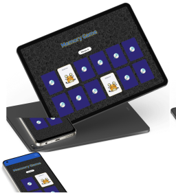
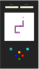
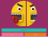
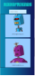
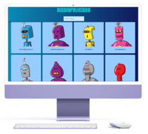
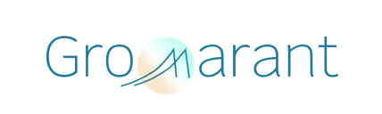

Mariangelica Rodriguez

Desarrolladora Full stack | Diseñadora UI/UX

 &nbsp; &nbsp;
 &nbsp; &nbsp;

 

  

Cambiar a:&nbsp; &nbsp; 

---

# Portafolio
Bienvenid@ a mi portafolio profesional!, Yo soy <a href="https://www.linkedin.com/in/mariangelicarodriguezperez" target="_blank">Mariangelica Rodriguez</a>, aquí puedes ver algunos de mis proyetos. Navega en sitios web, prototipos, mockups y repositorios.

Explora mi trabajo en los siguientes enlaces.

 

# Proyectos:

&nbsp; &nbsp;  &nbsp; &nbsp;
  FullPokeApp:

 

 

### Descripción:
Aplicación web desarrollada en React.js, SASS y Nextui.

### Funciones:
  - Juego de memoria.
  - Buscador.
  - Sección para crear Pokémones.

### Links del proyecto:

 &nbsp; &nbsp;

 

---

&nbsp; &nbsp;  &nbsp; &nbsp;
  GromaSnake:

 

 

### Descripción:
Juego desarrollado en HTML, CSS y JavaScript vanilla.

### Funciones:
  - Juego de la culebra.
  - Reiniciar el juego.
  - Ver Puntaje y score.

### Links del proyecto:

 &nbsp; &nbsp;
 &nbsp; &nbsp;
 &nbsp; &nbsp;

 

---

&nbsp; &nbsp;  &nbsp; &nbsp;
  FunFace:

 

 

### Descripción:
Página web estática, desarrollada en HTML, CSS y JavaScript vanilla.

### Funciones:
  - Mostrar un emoji aleatorio.
  - Elegir emoji a mostrar desde selector.

### Links del proyecto:

 &nbsp; &nbsp;
 &nbsp; &nbsp;

 

---

&nbsp; &nbsp;  &nbsp; &nbsp;
  Robopage:

 

 

### Descripción:
Aplicación web en React.js.

### Funciones:
  - Buscador con solicitud de datos a una Api externa.

### Links del proyecto:

 &nbsp; &nbsp;

 

---

 

© Mariangelica Rodriguez

 &nbsp; &nbsp;
 &nbsp; &nbsp;

  

