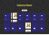
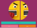

Mariangelica Rodriguez

Full stack developer | UI/UX product designer

 &nbsp; &nbsp;
 &nbsp; &nbsp;

 

  

Change to:&nbsp; &nbsp; 

---

# Portfolio
Welcome to my professional portfolio! I am <a href="https://www.linkedin.com/in/mariangelicarodriguezperez" target="_blank">Mariangelica Rodriguez</a>, here you can see some of my projects. Dive into websites, prototypes, mockups, and repositories. 

Explore my work in the following links.

 

# Projects:

&nbsp; &nbsp;  &nbsp; &nbsp;
  FullPokeApp:

 

 

### Description:
Web application developed in React.js, SASS and Nextui.

### Functions:
  - Memory game
  - Search engine
  - Pokémon creation

### Languages and tools:
 

<a href="https://react.dev/" title="know more about React.js" target="_blank">React.js</a>  &nbsp; &nbsp; &nbsp;
  

<a href="https://www.google.com/search?q=sass&rlz=1C1CHBF_esES930ES930&oq=sass&gs_lcrp=EgZjaHJvbWUqBggAEEUYOzIGCAAQRRg7MgYIARBFGDwyBggCEEUYPDIGCAMQRRg8MgYIBBBFGD0yBggFEEUYQTIGCAYQRRhBMgYIBxBFGDzSAQgxMDc5ajBqNKgCALACAQ&sourceid=chrome&ie=UTF-8" title="know more about SASS" target="_blank">SASS</a> &nbsp; &nbsp; &nbsp;

<a href="https://nextui.org/" title="know more about Nextui" target="_blank">Nextui</a>

 

### Project links:

 &nbsp; &nbsp;

 

---

&nbsp; &nbsp;  &nbsp; &nbsp;
  GromaSnake:

 

 

### Description:
Game developed in HTML, CSS and JavaScript.

### Functions:
  - Snake game
  - Reset game
  - See points and score

### Languages and tools:
 

<a href="https://developer.mozilla.org/en-US/docs/Web/HTML" title="know more about HTML" target="_blank">HTML</a>  &nbsp; &nbsp; &nbsp;

<a href="https://developer.mozilla.org/en-US/docs/Web/CSS" title="know more about CSS" target="_blank">CSS</a>  &nbsp; &nbsp; &nbsp;

<a href="https://developer.mozilla.org/en-US/docs/Web/JavaScript" title="know more about Javascript" target="_blank">Javascript</a>  &nbsp; &nbsp; &nbsp;

 

### Project links:

 &nbsp; &nbsp;
 &nbsp; &nbsp;
 &nbsp; &nbsp;

 

---

&nbsp; &nbsp;  &nbsp; &nbsp;
  FunFace:

 

 

### Description:
Static web page, build with HTML, CSS and JavaScript vanilla.

### Functions:
  - Display random emoji
  - Emoji selector

### Languages and tools:
 

<a href="https://developer.mozilla.org/en-US/docs/Web/HTML" title="know more about HTML" target="_blank">HTML</a>  &nbsp; &nbsp; &nbsp;

<a href="https://developer.mozilla.org/en-US/docs/Web/CSS" title="know more about CSS" target="_blank">CSS</a>  &nbsp; &nbsp; &nbsp;

<a href="https://developer.mozilla.org/en-US/docs/Web/JavaScript" title="know more about Javascript" target="_blank">Javascript</a>  &nbsp; &nbsp; &nbsp;

 

### Project links:

 &nbsp; &nbsp;
 &nbsp; &nbsp;

 

---

&nbsp; &nbsp;  &nbsp; &nbsp;
  Robopage:

 

 

### Description:
React web app.

### Functions:
  - Search engine with API fetch data.

### Languages and tools:
 

<a href="https://react.dev/" title="know more about React.js" target="_blank">React.js</a>

 

### Project links:

 &nbsp; &nbsp;

 

---

 

© Mariangelica Rodriguez

 &nbsp; &nbsp;
 &nbsp; &nbsp;

  

